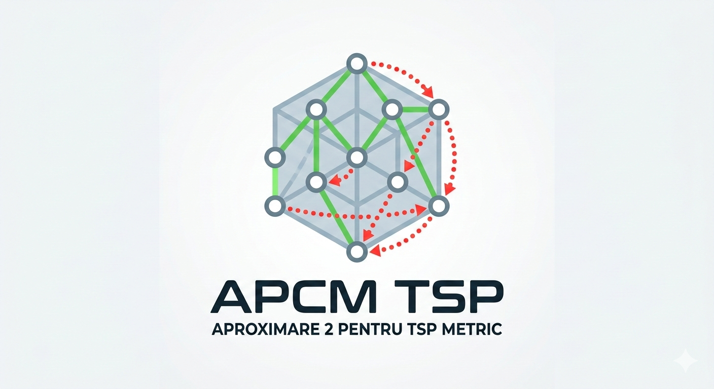

# Vizualizator Interactiv TSP - Aproximare 2 🌐

O aplicație web interactivă care demonstrează vizual algoritmul de **Aproximare 2 pentru Problema Comis-Voiajorului (TSP) în spațiul metric**. 

Proiectul permite utilizatorilor să plaseze "orașe" (noduri) pe un ecran și explică pas cu pas modul în care un **Arbore Parțial de Cost Minim (APCM)** poate fi folosit pentru a genera un traseu TSP valid, folosind parcurgerea în preordine și scurtături.

 

## ✨ Caracteristici Principale

* **Interactivitate în Timp Real:** Adaugă noduri dând click pe pânza de desen (canvas).
* **Vizualizare Side-by-Side (Ecran Împărțit):** După calcul, ecranul se desparte în două panouri pentru a compara vizual APCM-ul (stânga) cu traseul TSP în formare (dreapta).
* **Animație Pas cu Pas:** Urmărește cum se construiește turul TSP muchie cu muchie.
* **Scurtături Evidențiate:** Liniile roșii punctate arată clar momentele în care algoritmul "sare" peste un nod deja vizitat (inegalitatea triunghiului).
* **Control prin Tastatură:** Poți avansa în animație apăsând tasta `Spațiu`.
* **100% Vanilla:** Construit exclusiv cu HTML, CSS și JavaScript nativ, fără librării sau framework-uri externe.

## 🚀 Cum se utilizează

1. Deschideți fișierul `index.html` în orice browser web modern. (Sau accesați [Link-ul Live](#https://stefanpopescu-ai.github.io/Aproximare-2-pentru-TSP-Metric/) dacă este găzduit pe GitHub Pages).
2. Faceți click pe spațiul alb pentru a adăuga cel puțin **3 orașe**.
3. Apăsați butonul **"Calculează APCM & Preordine"**.
4. Ecranul se va împărți în două. Utilizați butonul **"Pasul Următor"** (sau apăsați tasta `Spațiu`) pentru a anima construcția traseului TSP.
5. Apăsați **"Resetează Pânza"** pentru a șterge ecranul și a încerca o altă configurație.

## 🛠️ Tehnologii Folosite

* **HTML5:** Structura paginii și elementele `<canvas>`.
* **CSS3:** Stilizare, design flexibil (Flexbox) și interfață adaptabilă.
* **JavaScript (ES6):** Logica algoritmilor (calculul distanțelor, algoritmul lui Kruskal pentru APCM, parcurgerea DFS) și randarea elementelor grafice.

## 🧠 Despre Algoritm

Algoritmul de aproximare 2 pentru TSP Metric garantează găsirea unui traseu al cărui cost nu este mai mare de **de două ori** costul traseului optim. Pașii sunt:
1. Calcularea Arborelui Parțial de Cost Minim (APCM) folosind algoritmul lui Kruskal.
2. Parcurgerea în adâncime (DFS) a arborelui pentru a obține o listă de noduri în preordine.
3. Conectarea nodurilor în ordinea stabilită, sărind peste nodurile deja vizitate (creând "scurtături" posibile datorită inegalității triunghiului specifică spațiilor metrice).
4. Întoarcerea la nodul de start pentru a finaliza turul.

## 📄 Licență

Acest proiect este open-source și poate fi folosit în scopuri educaționale.
